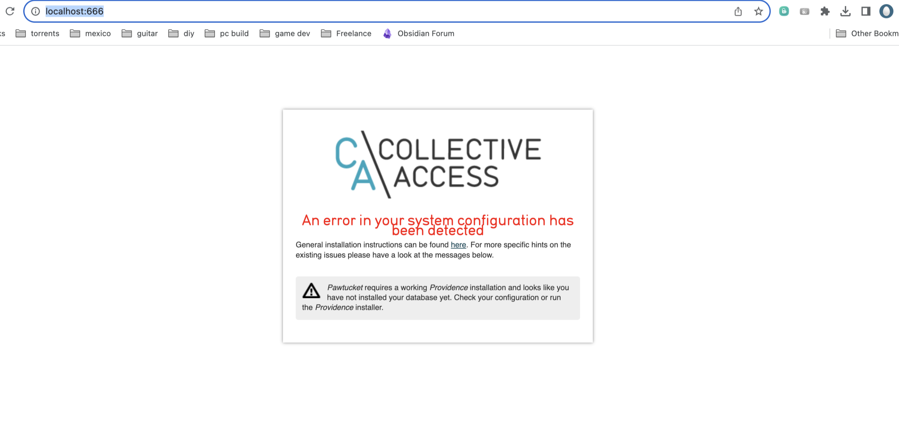

# meredith-monk-collectiveaccess

Meredith Monk / House Foundation Collective Access setup.

Based on [these Dockerfiles](https://github.com/artturimatias/CollectiveAccess),
but using docker-compose for managing services.

## to run locally

`brew services stop mysql` in case that is clashing with mysql container port
once everything is running you should see


Then go to [the install url](http://localhost:666/providence/install/)

## Note

on cloud, the files are in /home/ptsd

## Google Cloud Setup

1. Set up Compute Engine VM with Ubuntu
2. Go to VPC Network -> External IP addresses, and set the IP address for the VM
   you just created as "Static"
3. Create a MySQL instance. On the "Overview" page, follow the instructions to
   "Connect from a Compute Engine VM Instance". Make sure both the Compute
   Engine VM and your development machine are whitelisted for access to the
   database.
4. Download `.env` file or populate one with the connection information for the
   new database.
5. SSH into the compute engine vm. Install docker and docker compose based on
   [these instructions](https://docs.mattermost.com/install/prod-docker.html).
   Also execute `sudo systemctl enable docker` so that docker starts at boot.
6. Clone this repo onto the compute engine vm, and copy the `.env` to the
   project root.
7. Run the service with `docker-compose up -d`, then attach to the container
   with `docker exec -it collectiveaccess /bin/bash`, and make sure permissions
   are set properly for the `/var/www/providence/media` directory by executing
   `chown -R www-data /var/www/providence/media` and `chgrp -R www-data
   /var/www/providence/media`.
8. Follow instructions
   [here](https://rogulski.it/blog/ftp-on-google-compute-enigne/) to set up FTP access. I had to delete the RANDFILE
   line in /usr/lib/ssl/openssl.conf in order to generate a cert. Set the
   local_root to the media directory in this repo, and add the ftpuser to the
   www-data group. I also had to remove the comments from the ends of the config
   file lines provided in this example.

## Exporting Config / SQL

## Debug

If an error is showing up, can ssh into the vm and remove/recreate the docker container:

```
gcloud config set project meredith-monk-website
gcloud beta compute --project "meredith-monk-website" ssh --zone "us-central1-a" "collectiveaccess"
```

## Adding more disk space

1. Resize the disk in the [GCP console](https://console.cloud.google.com/compute/disksDetail/zones/us-central1-a/disks/collectiveaccess-standard?project=meredith-monk-website).

2. SSH into the server (see above). Change to the `ptsd` user where the project is installed, and cd to that user's home directory:

```
sudo su ptsd
cd /home/ptsd/meredith-monk-collectiveaccess
```

3. View disk space available to confirm disk space exhausted:

```
df -Th
sudo lsblk
```

3. Stop the service in this project directory:

```
docker-compose down
```

4. Grow the partition to use the disk space show with `lsblk`
```
sudo growpart /dev/sda 1
```

5. Grow the filesystem:
```
sudo resize2fs /dev/sda1
```

6. Confirm the filesystem now has the full space allotted in step 1, and restart the docker containers:

```
docker-compose up -d
```

